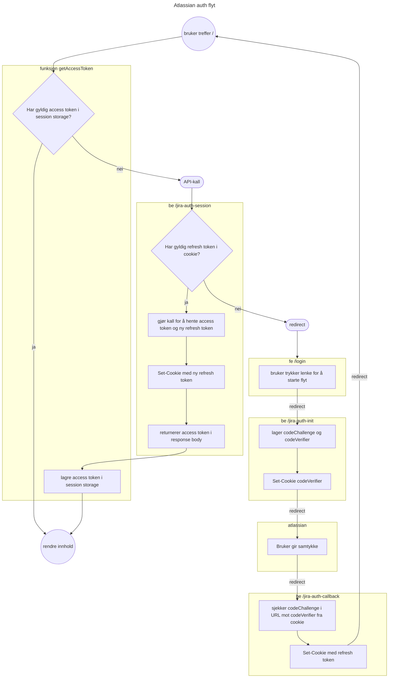

# Autentisering

JiraSync autentiserer mot to systemer: Jira (Atlassian) og Bekk Timekeeper (Azure Entra ID). De to flytene er helt uavhengige av hverandre.

## Jira (Atlassian OAuth 2.0 med PKCE)

Jira-autentisering bruker OAuth 2.0 Authorization Code Grant med PKCE. Hele OAuth-flyten kjører server-side via Netlify Functions for å holde `JIRA_CLIENT_SECRET` utenfor nettleseren.

Se Atlassian-dokumentasjon om [OAuth 2.0 (3LO) apps](https://developer.atlassian.com/cloud/jira/platform/oauth-2-3lo-apps/).

### Flyt




### Token-håndtering i nettleseren

Klienten (`src/login/jira/authContext.ts`) håndterer token-livssyklusen:

1. **Hent token**: Sjekker om det finnes et gyldig access token i `sessionStorage`
2. **Bruk cached token**: Hvis tokenet ikke er utløpt, returner det direkte
3. **Refresh**: Hvis tokenet er utløpt, kaller `/.netlify/functions/jira-auth-session` som bruker refresh token-cookien til å hente nytt access token + refresh token
4. **Lagre**: Nytt access token og utløpstid lagres i `sessionStorage`

Access tokens i `sessionStorage` er kortlevde (1 time). Refresh tokens er langvarige (90 dager), lagres kun i httpOnly cookies, og er ikke tilgjengelige fra JavaScript.

### Logout

`/.netlify/functions/jira-auth-logout` sletter refresh token-cookien. Klienten sletter access token fra `sessionStorage`.

### Scopes

- `read:jira-work` — Lese worklogs
- `read:jira-user` — Lese brukerinfo
- `offline_access` — Få refresh token

### Serverless-funksjoner

| Funksjon | Fil | Beskrivelse |
|---|---|---|
| `jira-auth-init` | `src/backend/jira-auth-init.ts` | Starter OAuth-flyten, genererer PKCE, redirecter til Atlassian |
| `jira-auth-callback` | `src/backend/jira-auth-callback.ts` | Mottar callback fra Atlassian, bytter code mot tokens |
| `jira-auth-session` | `src/backend/jira-auth-session.ts` | Refresher access token via refresh token cookie |
| `jira-auth-logout` | `src/backend/jira-auth-logout.ts` | Sletter refresh token cookie |

### Konfigurasjon

- `JIRA_CLIENT_ID` og `JIRA_CLIENT_SECRET` - Må tilhøre en app med relevante scopes konfigurert. Settes som environment-variabler i Netlify.
- `VITE_ATLASSIAN_CLOUD_ID` - Cloud Id til den aktuelle Jira Cloud-instansen.

## Bekk (Azure Entra ID via MSAL)

Bekk-autentisering bruker Azure Entra ID med MSAL (Microsoft Authentication Library). Hele flyten kjører i nettleseren — ingen server-side komponenter.

### Flyt

```
Bruker åpner appen
       │
       ▼
MsalAuthenticationTemplate sjekker innlogging
       │  Ikke innlogget? → Redirect til Azure login
       ▼
Azure Entra ID login-side
       │  Bruker logger inn med Bekk-konto
       ▼
Redirect tilbake til appen
       │  MSAL lagrer tokens i localStorage
       │  Setter aktiv konto
       ▼
Appen er klar
```

### Oppsett (`src/login/bekk/bekkLogin.tsx`)

MSAL-instansen er en modul-singleton (`msalInstance`) konfigurert med:
- `clientId` — App registration client ID fra Azure
- `authority` — `https://login.microsoftonline.com/{tenantId}`
- `cacheLocation` — `localStorage`

`BekkEntraLogin`-komponenten wrapper appen og håndterer automatisk redirect til innlogging.

### Employee ID

`getEmployeeId()` leser `employeeId`-claimet fra ID-tokenet til den aktive MSAL-kontoen. Denne brukes for å hente riktig brukers data fra Bekk Timekeeper API.

Viktig: Kall `getEmployeeId()` inne i `queryFn`, ikke på hook-nivå — MSAL-instansen må være ferdig initialisert.

### Token-refresh

MSAL håndterer token-refresh automatisk via `acquireTokenSilent()`. Bekk API-klienten (`src/data/bekkclient.ts`) kaller dette i middleware før hvert API-kall.

### Azure-registreringer

| Miljø | App registration |
|---|---|
| Prod | [97690193-50da-4eda-b961-519d047cc8ce](https://portal.azure.com/#view/Microsoft_AAD_RegisteredApps/ApplicationMenuBlade/~/Overview/appId/97690193-50da-4eda-b961-519d047cc8ce) |
| Dev | [05d0e69d-bb21-43b6-bdd0-5eed364561c0](https://portal.azure.com/#view/Microsoft_AAD_RegisteredApps/ApplicationMenuBlade/~/Overview/appId/05d0e69d-bb21-43b6-bdd0-5eed364561c0) |

### Konfigurasjon

- `VITE_BEKK_ENTRA_TENANT_ID` — Azure tenant ID
- `VITE_BEKK_ENTRA_CLIENT_ID` — App registration client ID
- `VITE_BEKK_ENTRA_SCOPE` — API scope for Bekk Timekeeper
